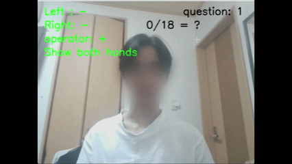

# Hand Gesture Calculator

Webカメラ映像から手指を認識し，指本数を用いた四則演算と計算クイズを行うリアルタイムアプリケーションです．

MediaPipeで取得した手のランドマークを特徴量として利用し，親指・人差し指・中指・薬指・小指それぞれの状態を5つのMLPで個別に判定します．

## デモ

デモ用に表示文字を大きくしています．  
プライバシー保護のため顔にはモザイクを入れています．

### 通常モード

左右の手の指本数を数値として扱い，キーボードで選択した演算子を用いて計算します．

<p align="center">
  
</p>

### クイズモード

表示された計算問題に対して，左右の手の指本数の合計で回答します．

<p align="center">
  
</p>

## 制作背景

画像処理授業のPBLで，動画像処理を用いた成果物を制作する課題に取り組みました．

授業で扱ったMediaPipeの手ランドマークを応用できないかと考え，PBLの正式開始前から試作を始めました．

手を使った動作の具体例を考える中で，指を使って数を表す動作に着目し，認識した指本数を数値入力として四則演算に利用するプログラムを制作しました．

試作後も，認識精度や未学習の手の形に対する問題を確認しながら判定方式を変更し，最終的に各指を個別に判定する方式と計算クイズ機能まで実装しました．

## PBLでの結果

完成したシステムを学内PBLで発表し，参加学生55名による投票で以下の結果となりました．

- 総合：1位（122点）
- 内容：1位（67点）
- 発表：2位（55点）

## 主な機能

- Webカメラから最大2つの手をリアルタイムに検出
- MediaPipeによる21点の手ランドマーク取得
- 手の位置・大きさの影響を抑えるためのランドマーク座標の正規化
- 5つの各指専用MLPによる曲げ・伸ばしの二値分類
- 各指の判定結果を合計した0〜5本の指本数認識
- 左右の手を数値入力として利用した四則演算
- 0除算時のエラー処理
- 直近10フレームの多数決による認識結果の安定化
- 全10問の計算クイズモード
- 回答維持時間とクールダウンによる連続判定の防止
- 学習データ収集・モデル再学習用プログラム

## 処理の流れ

```text
Webカメラから映像を取得
        ↓
MediaPipeで手と21点ランドマークを検出
        ↓
手首を原点として座標を相対化
        ↓
手首から中指付け根までの距離を基準に正規化
        ↓
各指に関係する9点を抽出
        ↓
9点 × xyz座標 = 27次元特徴量を作成
        ↓
27次元特徴量を各指専用MLPへ入力
        ↓
5つのMLPで各指の曲げ・伸ばしを個別に判定
        ↓
5つの判定結果を合計して指本数を算出
        ↓
算出した結果を四則演算またはクイズの回答として利用
```


## 指本数認識方式の改善

制作中に認識上の問題を確認し，判定方式を段階的に変更しました．

### 1．ランドマーク間距離によるルールベース判定

最初の試作では，手首から指先・関節までの距離を比較して，各指が伸びているかを判定していました．

処理は軽量でしたが，手の角度や親指の向きなどによって指本数を誤認識しやすい問題がありました．

### 2．指本数を直接予測する6クラスMLP

距離による判定だけでは手の形の違いを十分に扱えないと考え，正規化した21点のランドマークを63次元特徴量として利用し，0〜5本の指本数を直接分類するMLPへ変更しました．

単純な指本数のポーズでは安定して認識できるようになりましたが，学習データに含まれていない指の組み合わせを試した際には誤認識が発生する問題が残りました．

### 3．各指専用の5つの二値分類MLP

未学習の指の組み合わせへの対応を考える中で，手全体を0〜5本という6種類に分類するのではなく，各指を曲げている／伸ばしているという独立した二値分類問題として扱えると考えました．

そこで，親指・人差し指・中指・薬指・小指それぞれに専用のMLPを用意し，5つの判定結果を組み合わせて指本数を求める方式へ変更しました．

この方式では，5本の指の組み合わせ32通りをそれぞれ独立したクラスとして学習するのではなく，各指の状態を個別に学習し，その判定結果の組み合わせとして手の状態を扱います．

一方で，5つのモデルを個別に推論する構成のため，単一モデル方式と比べて推論回数が増えます．

## クイズモードでの工夫

四則演算だけでなく，認識した指本数を回答入力として利用する計算クイズモードを実装しました．

リアルタイム映像では同じジェスチャーが複数フレーム連続して検出されるため，単純に判定すると1回の回答が複数回入力される問題があります．

そこで，同じ回答を2秒間維持した場合のみ回答として確定し，判定後には次の問題へ移るまでクールダウンを設けることで連続判定を防止しました．

クイズは全10問で，終了後に正解数を表示します．

## 使用技術

| 技術 | 用途 |
|---|---|
| Python | プログラム全体の実装 |
| OpenCV | Webカメラ入力，映像表示，描画，キー入力 |
| MediaPipe | 手の検出と21点ランドマーク取得 |
| PyTorch | 各指専用MLPの学習・推論 |
| NumPy | 座標計算・特徴量処理 |
| pandas | CSV形式の学習データ読み込み |
| scikit-learn | 学習・テストデータ分割，モデル評価 |

## 実行方法

実行にはWebカメラが必要です．

### 1．リポジトリを取得

```bat
git clone https://github.com/koutatakahashiit/hand-gesture-calculator.git
cd hand-gesture-calculator
```

### 2．仮想環境を作成

```bat
python -m venv .venv
.venv\Scripts\activate.bat
```

### 3．必要なライブラリをインストール

```bat
python -m pip install -r requirements.txt
```

### 4．プログラムを実行

```bat
python main.py
```

## 操作方法

### 通常モード

| キー | 動作 |
|---|---|
| `+` | 足し算 |
| `-` | 引き算 |
| `*` | 掛け算 |
| `/` | 割り算 |
| `c` | クイズモード開始 |
| `q` | プログラム終了 |

左右の手の指本数を，それぞれ計算式の左辺と右辺として扱います．

割り算では，右手の指本数が0の場合に0除算として処理します．

### クイズモード

`c`キーを押すと，全10問のクイズモードを開始します．

計算式の答えを左右の手の指本数の合計で表し，同じ回答を2秒間維持すると正誤を判定します．

10問終了後に正解数を表示し，通常モードへ戻ります．

## 学習データの収集・再学習

### 学習データの収集

以下を実行すると，学習データ収集用のプログラムを起動できます．

```bat
python collect_finger_landmarks.py
```

1つの手をWebカメラに映し，各指の状態をラベルとして設定してランドマークとともに保存します．

各指のラベルは，`0`を曲げている，`1`を伸ばしていると定義しています．

| キー | 動作 |
|---|---|
| `1` | 親指のラベルを0／1で切り替える |
| `2` | 人差し指のラベルを0／1で切り替える |
| `3` | 中指のラベルを0／1で切り替える |
| `4` | 薬指のラベルを0／1で切り替える |
| `5` | 小指のラベルを0／1で切り替える |
| `s` | 現在のランドマークとラベルを保存する |
| `q` | 終了する |

誤ったデータの保存を防ぐため，手が1つだけ検出されている場合にのみ保存します．

保存先：

```text
data/hand_landmarks_and_states.csv
```

### 各指モデルの再学習

以下を実行すると，収集したデータを用いて5つの各指専用MLPを再学習します．

```bat
python train_finger_mlp.py
```

再学習の対象は，親指・人差し指・中指・薬指・小指それぞれの二値分類モデルです．

学習済みモデルは`models/`以下に保存されます．

```text
models/t_finger_mlp_model.pth
models/i_finger_mlp_model.pth
models/m_finger_mlp_model.pth
models/r_finger_mlp_model.pth
models/p_finger_mlp_model.pth
```

再学習を実行すると，既存の5つの学習済みモデルは新しい学習結果で上書きされます．

## モデル評価

現在の学習データは720件です．

各指について，正解ラベルの比率を維持したまま学習データ80%，テストデータ20%に分割して評価しています．

| 指 | テスト精度 |
|---|---:|
| 親指 | 95.14% |
| 人差し指 | 98.61% |
| 中指 | 99.31% |
| 薬指 | 100.00% |
| 小指 | 98.61% |

これらは各指専用MLP単体の二値分類精度です．
5つの予測結果を組み合わせた最終的な指本数認識精度を表すものではありません．

詳細な評価方法，データセット，評価上の制約については [`model_evaluation.md`](model_evaluation.md) に記載しています．

## 現時点の制約

- 学習データは主に同一人物・同一PC・同一Webカメラ環境で収集している
- 未知の人物や異なるカメラ・照明環境を用いた定量的な評価は行っていない
- 連続して収集した類似データが学習用・テスト用の双方に含まれている可能性がある
- 各指モデル単体の分類精度は測定しているが，5つの出力を組み合わせた最終的な指本数認識精度は未測定
- 5つのMLPを順番に推論するため，単一モデル方式より処理量が増える
- 演算子の選択にはキーボードを使用する
- UIはOpenCV上の簡易表示である

## プロジェクト構成

```text
hand-gesture-calculator/
├─ assets/                       # デモ用画像・GIF
├─ back_up/                      # 開発途中の試作コード
├─ data/
│  └─ hand_landmarks_and_states.csv
├─ models/
│  ├─ hand_landmarker.task
│  ├─ t_finger_mlp_model.pth
│  ├─ i_finger_mlp_model.pth
│  ├─ m_finger_mlp_model.pth
│  ├─ r_finger_mlp_model.pth
│  └─ p_finger_mlp_model.pth
├─ main.py                       # アプリ本体
├─ collect_finger_landmarks.py   # 学習データ収集
├─ train_finger_mlp.py           # 各指MLPの学習・評価
├─ model_evaluation.md           # モデル評価の詳細
├─ requirements.txt
└─ README.md
```


## 今後の改善

- 複数人物による学習・評価データの追加
- 異なるカメラ・照明・背景環境での評価
- 最終的な0〜5本の指本数認識精度の測定
- MediaPipe・MLPの推論頻度を調整した軽量化と，FPS・処理負荷・操作感への影響の評価
- lightgbm等の他の分類モデルとの比較
- 演算子選択のジェスチャー化
- 2進数入力モード
- UIの改善

## 開発履歴

`back_up`フォルダには，機能を段階的に実装・検証した際の試作コードを保存しています．

旧6クラス分類版はGitの`v0.1.0-demo`タグから確認できます．